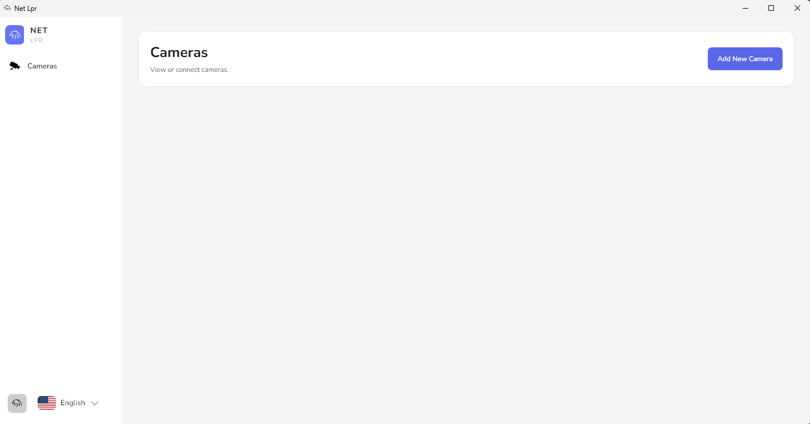
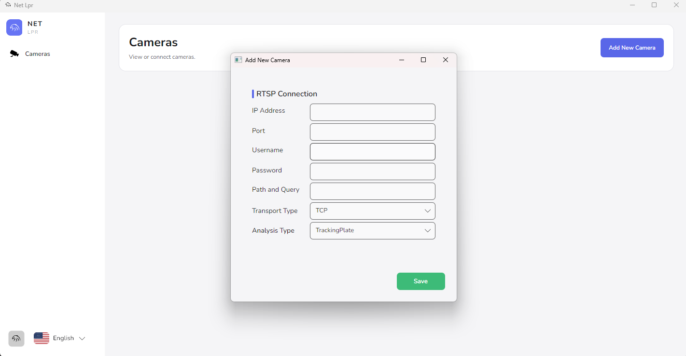
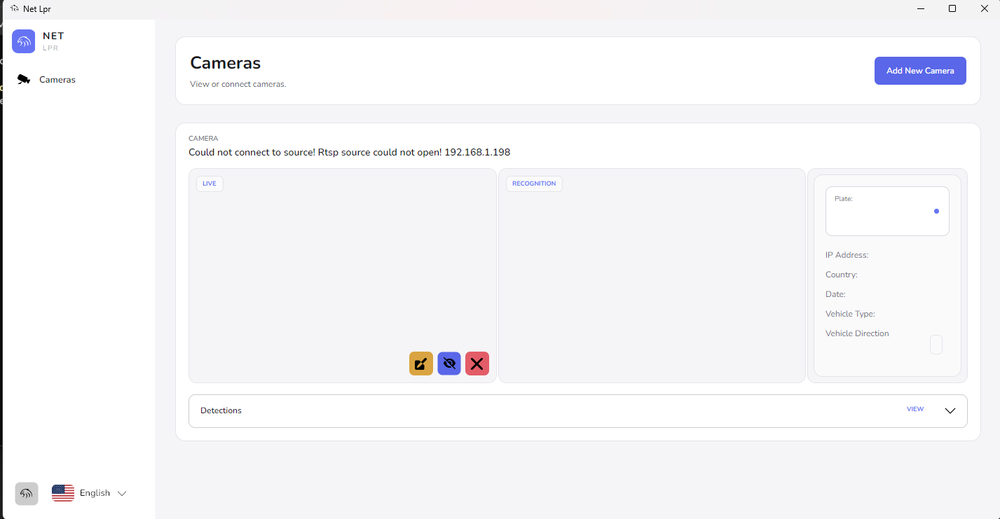
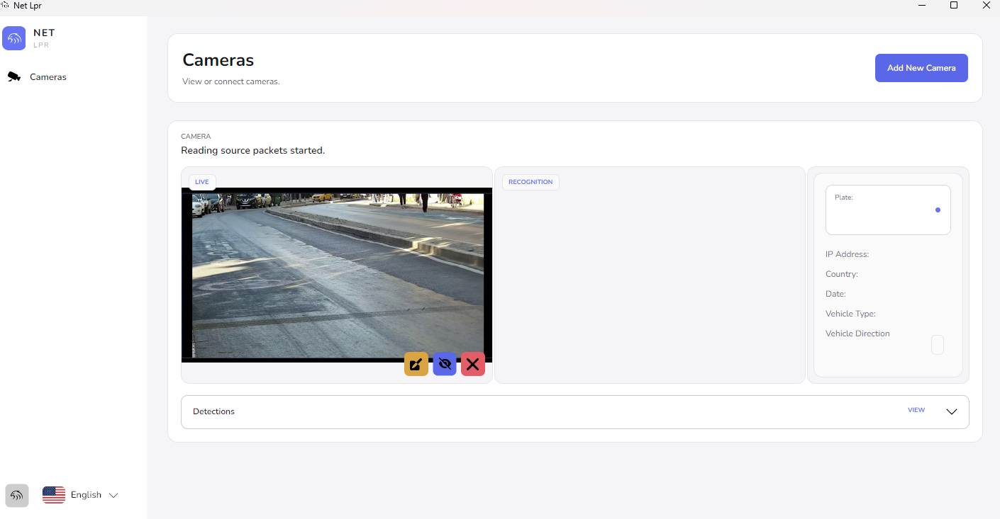
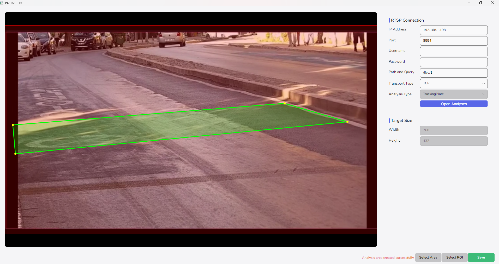
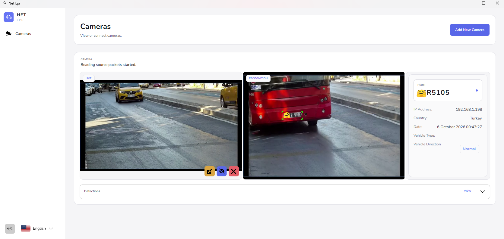
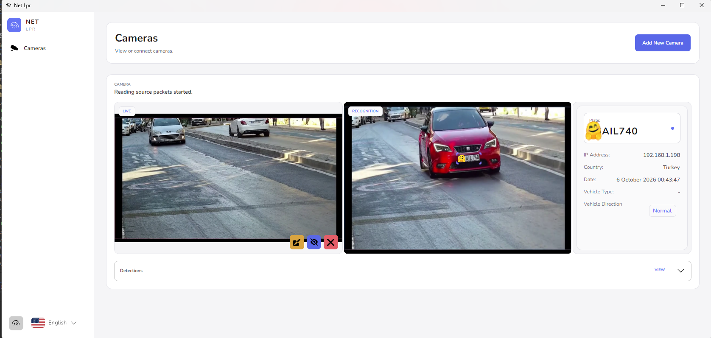
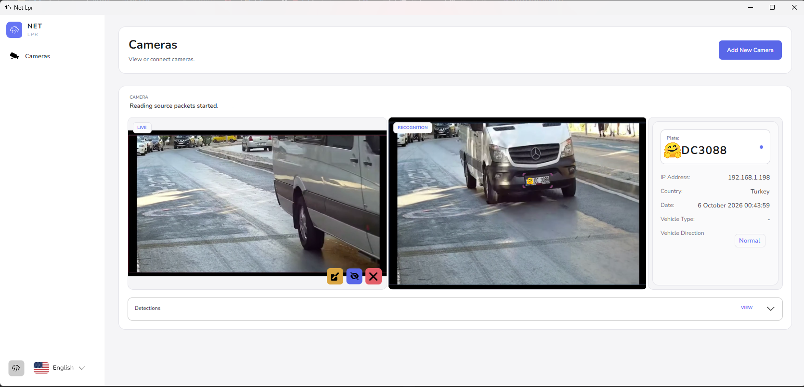

[English](./README.md) ·  [Türkçe](./README.tr.md)
# 🚗⚡ NetLpr

### AI-Powered Real-Time License Plate Recognition & Vehicle Tracking

**NetLpr** is a desktop application built on **.NET 8** and **C#**, designed for real-time **LPR / ANPR**, vehicle detection, license plate recognition, and vehicle tracking using RTSP/IP camera streams.

---

## ✨ Features

* 🎥 **Real-Time RTSP/IP Camera Support**
* 🤖 **AI-Powered Vehicle & License Plate Detection**
* 🔤 **OCR-Based License Plate Recognition**
* 🧠 **Intel OpenVINO™ Inference**
* 💾 **SQLite + Entity Framework Core**
* 🌐 **Runtime Dynamic Localization**
* 🎨 **Modern Fluent UI**
* 🖥️ **Cross-Platform Avalonia UI**
* 🧵 **Asynchronous & High-Performance Processing Pipeline**
* 🧠 **C# Unsafe Memory Optimizations**
* 📝 **Structured Logging with Serilog**
* ⚙️ **Modular & Extensible Architecture**

---

## 🏗️ Architecture


```text
NetLpr/
│
├── 🚀 NetLpr.Boot
│   └── Application startup, DI Container & IoC configuration
│
├── 🧠 NetLpr.Core
│   └── Domain models, business logic & service contracts
│
├── 📹 NetLpr.Realtime
│   └── FFmpeg-based low-latency RTSP stream processing
│
├── 👁️ NetLpr.ImageProcessingCv
│   └── OpenCV image processing & memory operations
│
├── 🤖 NetLpr.InferenceOv
│   └── OpenVINO inference engine & OCR processing
│
├── 💾 NetLpr.Persistence
│   └── EF Core, SQLite, migrations & repositories
│
├── 📝 NetLpr.Logs
│   └── Serilog-based structured logging
│
├── 🌐 NetLpr.Localization
│   └── Runtime localization & language dictionaries
│
└── 💻 NetLpr.Desktop
    └── Avalonia UI & MVVM desktop application
```

---

# 📸 Screenshots

     ### 🖥️ Main Dashboard

     Real-time camera streams, detected plates, system statistics, and live processing status.

     ### 🎥 Camera Configuration & ROI

     Configure RTSP connections and interactively define **Region of Interest (ROI)** areas directly on the camera image.

     ### 📊 Detection History

     Detected vehicles and license plates can be inspected through a searchable and filterable history interface.

<table>
  <tr>
    <td></td>
    <td></td>
    <td></td>
  </tr>
  <tr>
    <td></td>
    <td></td>
    <td></td>
  </tr>
  <tr>
    <td></td>
    <td></td>
    <td></td>
  </tr>
</table>

---
# 🧠 AI Pipeline

The recognition pipeline consists of multiple stages:

```text
Camera Frame
     │
     ▼
Vehicle Detection
     │
     ▼
Vehicle Tracking
     │
     ▼
License Plate Detection
     │
     ▼
Image Preprocessing
     │
     ▼
Plate Detection
     │
     ▼
    OCR
     │
     ▼
Detection Result
```

The modular inference layer allows different models and inference backends to be integrated without coupling them to the desktop application.

---

# 💾 Data Persistence

NetLpr uses **Entity Framework Core** with **SQLite** for local persistence.

Stored information can include:

* License plate results
* Detection timestamps
* Camera configuration
* Analysis configuration
* Application settings
* Historical tracking information

The persistence layer is isolated from the domain and UI layers, allowing alternative database providers to be introduced when required.

---

# 🌐 Localization

NetLpr includes a dedicated localization layer:

```text
NetLpr.Localization
```

Language resources can be changed at runtime without restarting the application.

This allows the desktop interface to dynamically react to language changes while keeping localization concerns separated from the business and presentation layers.

---

# 🎨 Desktop Application

The desktop client is built with:

* **Avalonia UI**
* **MVVM**
* **Fluent UI**
* **.NET 8**

The UI is designed to provide a modern desktop experience while remaining independent from a specific operating system.

---

# 🛠️ Technology Stack

| Technology                | Usage                                   |
| ------------------------- | --------------------------------------- |
| **C#**                    | Application & performance-critical code |
| **.NET 8**                | Runtime & application platform          |
| **Avalonia UI**           | Cross-platform desktop UI               |
| **OpenVINO™**             | AI inference acceleration               |
| **OpenCV**                | Image processing                        |
| **FFmpeg.AutoGen**        | RTSP/video decoding                     |
| **Entity Framework Core** | ORM & persistence                       |
| **SQLite**                | Local database                          |
| **Serilog**               | Structured logging                      |
| **MVVM**                  | UI architecture                         |

---

# 📦 Requirements

Before running NetLpr, make sure the development environment contains:

* .NET 8 SDK
* A supported Windows, Linux, or macOS environment
* Compatible FFmpeg runtime libraries
* OpenVINO runtime
* Compatible AI models
* 🤖 **AI Model [fast-alpr](https://github.com/ankandrew/fast-alpr)**

---

# ⚙️ Configuration

Camera and inference settings are configured through the application.

Typical configuration includes:

```text
Camera
├── RTSP URL
├── Authentication
├── Stream configuration
└── ROI

Inference
├── Vehicle Detection Model
├── License Plate Detection Model
├── OCR Model
├── Confidence Threshold
└── Target Device

Processing
├── Resolution
├── FPS
├── Tracking
└── Preprocessing
```

---

# 📁 Project Structure

```text
NetLpr
│
├── NetLpr.Boot
├── NetLpr.Core
├── NetLpr.Realtime
├── NetLpr.ImageProcessingCv
├── NetLpr.InferenceOv
├── NetLpr.Persistence
├── NetLpr.Logs
├── NetLpr.Localization
└── NetLpr.Desktop
```


<div align="center">

### 🚗 NetLpr

**Real-Time License Plate Recognition • AI • Computer Vision**

</div>